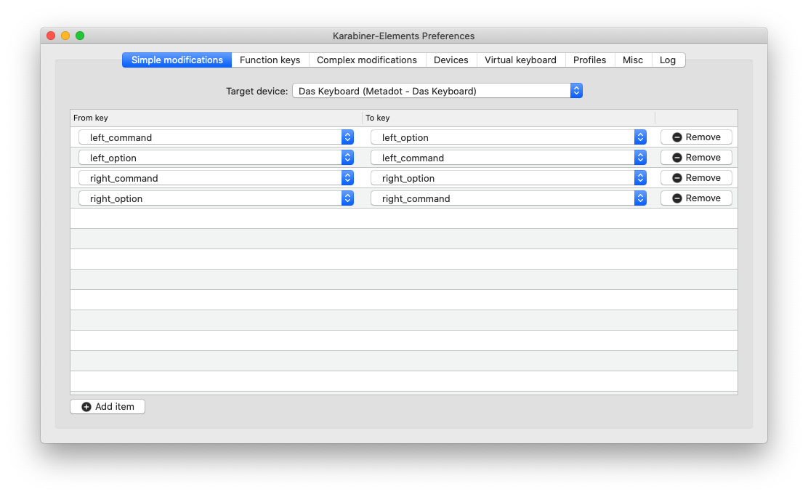

# neo2-layout-osx
Neo2 keyboard layout file for macOS.

This is based on the file provided by [neo-layout.org](http://neo-layout.org/),
but has a number of improvements:

* Improved caps lock layout: Top row still provides the numbers (special symbols
  require shift in addition to caps lock), letters are switched to lowercase
  when <kbd>Shift</kbd> is pressed, allow to type layer 3 symbols with
  <kbd>Mod 3</kbd> when caps lock is active.
* Fixes to the handling of <kbd>Mod 3</kbd>+<kbd>Cmd</kbd> to increase
  compatibility with shortcuts (though, shortcuts involving <kbd>M3</kbd> can 
  still be problematic and will remain so for the foreseeable future).
* A few unassigned keys in the layout have been fixed.
* Fixed layer 4 minus.
* Fixed the layout of the <kbd>Ctrl</kbd> modifier to work in MacVim.
* Fixed compose function for ñ.
* Fixed layer 4 and 6 of the "grave_accent_and_tilde" key (the one left of
  <kbd>1</kbd>).
* Fixed <kbd>Ctrl</kbd>+<kbd>J</kbd>.
* Alternative icons that can be used with the new dark mode in macOS Mojave.

# Installation

1. Copy `neo.keylayout` and one of the icons (`neo*.icns`) renamed to `neo.icns`
   to `~/Library/Keyboard Layouts/` (user install) or
   `/Library/Keyboard Layouts/` (system-wide install).
2. Reboot.
3. Add "Deutsch (Neo 2)" in the Input Sources tab of the Keyboard system
   settings.

To get access to all layers, also install [Karabiner
Elements](https://pqrs.org/osx/karabiner/) and import [the Neo2 complex rule
set](https://pqrs.org/osx/karabiner/complex_modifications/#neo2). Activate the
desired complex modifications (probably you want at least "Neo2 layer 4", "Neo2
layer 6", and one of the "Neo2 mod 3 and 4 keys" rules).

On Windows keyboards the <kbd>Cmd</kbd> and <kbd>Alt</kbd> keys are swapped
compared to Apple keyboards. You may want switch the key assignment which can
be done with "simple modifications" in Karabiner Elements (also specifically
for a single device/keyboard if you have multiple keyboards). To swap all for
keys add the following modifications:

| From key        | To key          |
|-----------------|-----------------|
| `left_command`  | `left_option`   |
| `left_option`   | `left_command`  |
| `right_command` | `right_option`  |
| `right_option`  | `right_command` |

# Know issues

* While the left <kbd>Option</kbd> does not fully act as <kbd>Mod 3</kbd> (it
  can be used in keyboard shortcuts and does not activate layer 6 in combination
  with <kbd>Mod 4</kbd>), it may map to layer 3 keys depending on how an
  application reads shortcuts. In particular, websites within a browser will
  usually see the layer 3 keys (i.e. <kbd>Option</kbd>+<kbd>i</kbd> becomes
  <kbd>Option</kbd>+<kbd>/</kbd>), while native applications often see the base
  layer.
* Some programs (often webbrowsers or webpages displayed in them) might
  interpret layer 3 keys as a shortcut. You can use one of the "Prevent *keys*
  from being treated as option key shortcut" rules in Karabiner Elements to
  prevent this. However, this can cause problems in other programs.
  Notably, the terminal in JetBrains IDEs (e.g. IntelliJ) will insert
  additional characters for those keys.
* When using one of the "Prevent *keys* from being treated as option key
  shortcut" rules in Karabiner Elements, those keys will produce an additional
  character in JetBrains IDE. This issue has been reported
  [upstream](https://youtrack.jetbrains.com/issue/JBR-1311?_ga=2.179409447.2093995893.1567764984-747787643.1539369234).
  As a workaround, open **Help | Edit Custom Properties**, add
  `com.jetbrains.use.old.keyevent.processing=true` and restart the IDE.
